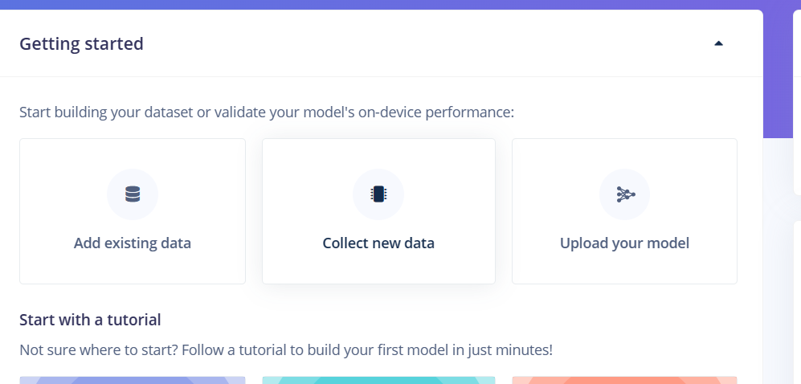

# Edge Impulse Arduino Camera Example

## Introduction

This repository contains an Arduino sketch for running an Edge Impulse machine learning model on an ESP32-based camera module. The sketch captures images from the camera, runs them through an Edge Impulse inference model, and outputs the results. This application is ideal for IoT devices and edge computing scenarios that require real-time image classification or object detection.

## Example

## User Installation Instructions

### Hardware Requirements:

- An ESP32-based camera module (e.g., ESP-EYE, AI-THINKER)
- A micro USB cable for programming

### Software Requirements:

- Arduino IDE: [Download here](https://www.arduino.cc/en/software)
- Edge Impulse CLI: Follow the [installation guide](https://docs.edgeimpulse.com/docs/cli-installation)

### Setup Instructions:

1. Clone or download this repository to your computer.
2. Open the `.ino` file within the Arduino IDE.
3. Connect your ESP32 camera module to your computer using the USB cable.
4. In the Arduino IDE, select the correct board and port from the Tools menu.
5. Compile and upload the sketch to your camera module.
6. Once the upload is complete, the device should start running the model automatically.

## How to Run the Code

After uploading the sketch:

1. Open the Serial Monitor in the Arduino IDE to view the inference results.
2. The device will now capture images and provide real-time inference results based on the Edge Impulse model.

## More Technical Details

The sketch is configured to interface with the Edge Impulse SDK and process images for inferencing. It includes the necessary camera configurations for different ESP32 camera models and captures images in JPEG format for processing.

## Known Issues/Future Improvements

- The code currently only supports ESP32-based camera modules.
- Future work could extend support to other microcontrollers and camera modules.
- Improvements could be made to increase the processing speed and inference accuracy.

